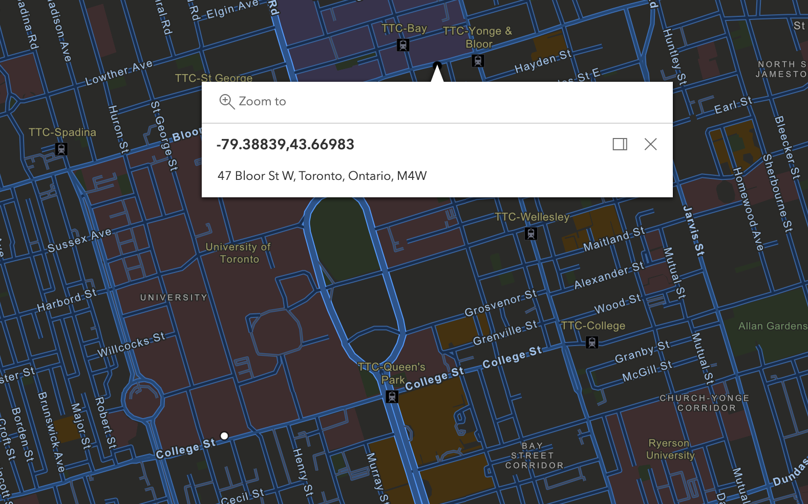

# H1 Hack the North Project - WalkSafe

# H2 Inspiration
When you find yourself in a new place, safety is often the main concern. We want to build an app that help frequent travellers to find a quick way to familiarize with the neighborhood and have fun while staying safe.

# H2 What it does
WalkSafe is an application which helps you pick the safest walking path between two destinations. It makes the decision based on existing crime data and aims to avoid areas with a high density of crimes.

Here's a quick demo:

# H2 How we built it
The street map data and crime statistics are gathered from Esri and Toronto Police Open Data. We used a simple Python program for data preprocessing and map reported coordinates to indicate crime density. The project uses JavaScript and React framework to visualize and provide user the best route to take in the neighborhood.

# H2 Challenges we ran into
Thoroughly reading through API documentation and feeding in processed backend data into map implementation.

# H2 What's next
Gather data worldwide to further assist travelling.
